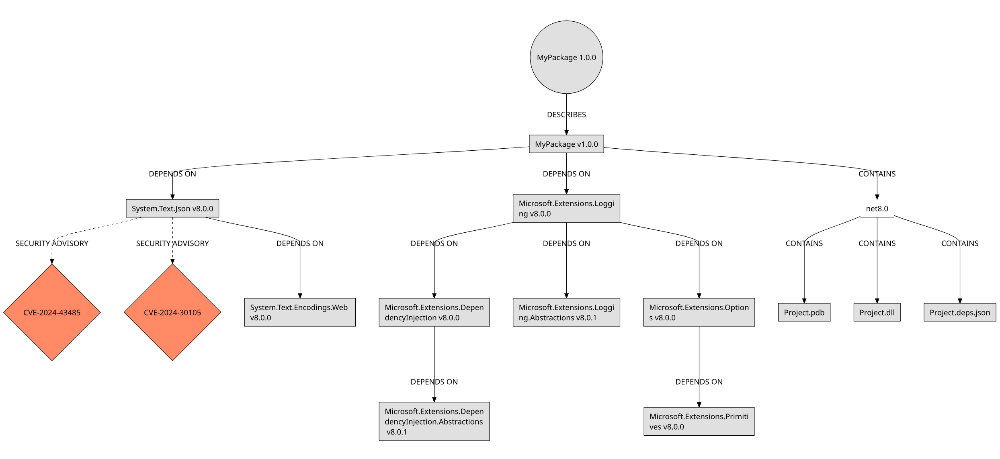
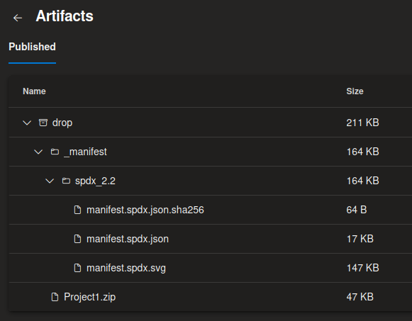

# SBOM Tool Azure DevOps Extension

Unofficial Azure DevOps extension for [microsoft/sbom-tool](https://github.com/microsoft/sbom-tool); Features include:

- Generate [SPDX 2.2](https://spdx.dev/) compatible SBOMs from Azure DevOps repository build artifacts.
- Generate SBOM manifest graph, visualising files, packages, dependencies, and security advisories.
- Check package dependencies for known vulnerabilities against the [GitHub Advisory Database](https://github.com/advisories).



_SBOM manifest graph example_

## Install

Install the extension from the [Visual Studio marketplace](https://marketplace.visualstudio.com/items?itemName=rhyskoedijk.sbom-tool).

## Usage
In YAML pipelines:

```yaml
jobs:
- job: publish
  steps:

  - task: DotNetCoreCLI@2
    displayName: 'Publish project'
    inputs:
      command: 'publish'
      publishWebProjects: true
      arguments: '--output "$(Build.ArtifactStagingDirectory)"'

  - task: sbom-tool@1
    displayName: 'Generate project SBOM manifest'
    inputs:
      command: 'generate'
      buildSourcePath: '$(Build.SourcesDirectory)'
      buildArtifactPath: '$(Build.ArtifactStagingDirectory)'
      enablePackageMetadataParsing: true
      fetchLicenseInformation: true
      fetchSecurityAdvisories: true
      gitHubConnection: 'GitHub Advisory Database Connection'
      packageSupplier: 'MyOrganisation'
      packageName: 'MyPackage'
      packageVersion: '$(Build.BuildNumber)'

  - task: PublishBuildArtifacts@1
    displayName: 'Publish artifacts'
    inputs:
      PathtoPublish: '$(Build.ArtifactStagingDirectory)'
      ArtifactName: 'drop'
      publishLocation: 'Container'
```

The SBOM manifest files will be uploaded to the `_manifest` folder of the build pipeline artifact container.



## Advanced

- [`rhyskoedijk/sbom-azure-devops` GitHub project](https://github.com/rhyskoedijk/sbom-azure-devops)
- [`microsoft/sbom-tool` GitHub project](https://github.com/microsoft/sbom-tool)
- [SPDX Online Tool](https://tools.spdx.org/app/)