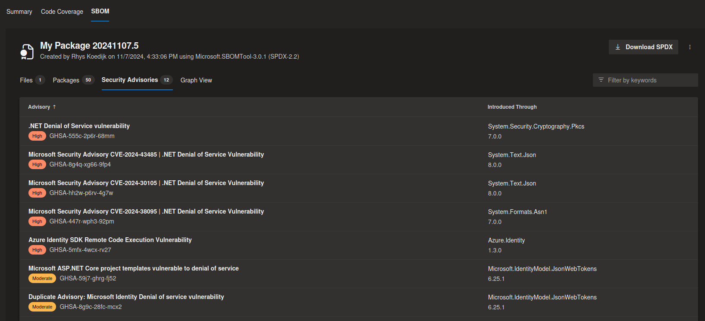
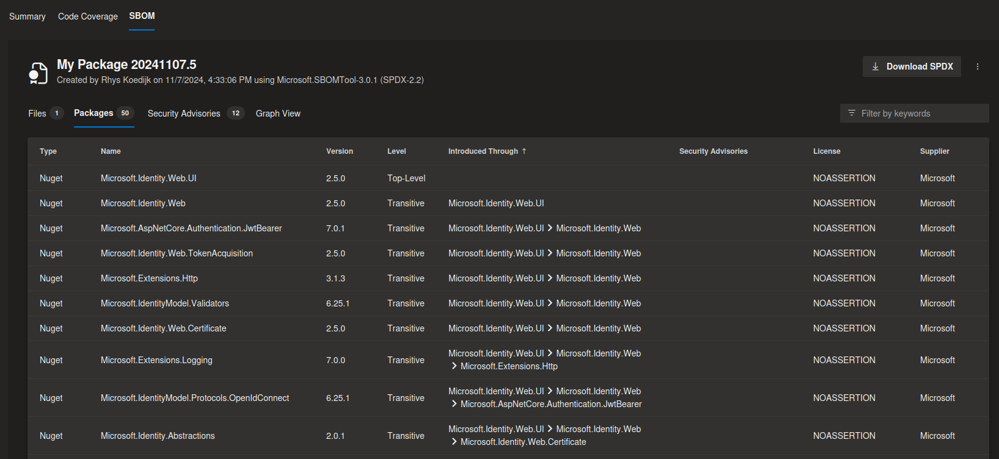
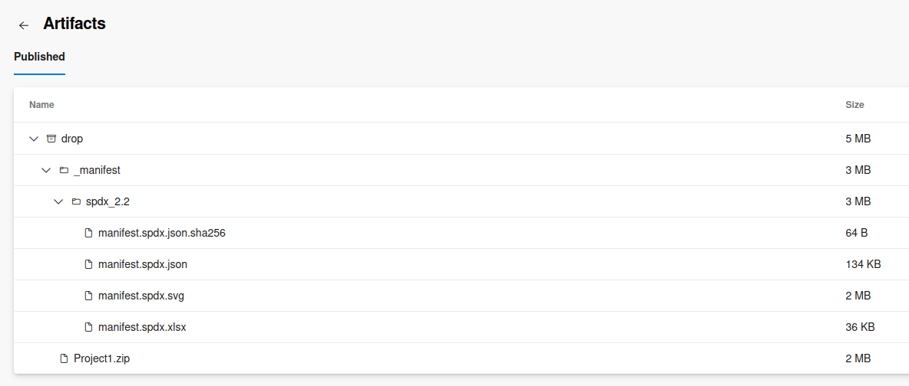

# SBOM Tool Azure DevOps Extension

Unofficial Azure DevOps extension for [microsoft/sbom-tool](https://github.com/microsoft/sbom-tool). Use this task to:

- Generate [SPDX 2.2](https://spdx.dev/) compatible SBOMs from Azure DevOps repository build artifacts;
- Check package dependencies for known vulnerabilities against the [GitHub Advisory Database](https://github.com/advisories);
- Graph manifest files, packages, dependencies, and security vulnerabilities as SVG image;
- Export manifest files, packages, dependencies, and security vulnerabilities as XLSX spreadsheet;






## Install

Install the extension from the [Visual Studio marketplace](https://marketplace.visualstudio.com/items?itemName=rhyskoedijk.sbom-tool).

## Usage

In YAML pipelines:

```yaml
jobs:
  - job: publish
    steps:
      - task: DotNetCoreCLI@2
        displayName: 'Publish project'
        inputs:
          command: 'publish'
          publishWebProjects: true
          arguments: '--output "$(Build.ArtifactStagingDirectory)"'

      - task: sbom-tool@1
        displayName: 'Generate project SBOM manifest'
        inputs:
          command: 'generate'
          buildSourcePath: '$(Build.SourcesDirectory)'
          buildArtifactPath: '$(Build.ArtifactStagingDirectory)'
          enablePackageMetadataParsing: true
          fetchLicenseInformation: true
          fetchSecurityAdvisories: true
          gitHubConnection: 'GitHub Advisory Database Connection'
          packageSupplier: 'MyOrganisation'
          packageName: 'MyPackage'
          packageVersion: '$(Build.BuildNumber)'

      - task: PublishBuildArtifacts@1
        displayName: 'Publish artifacts'
        inputs:
          PathtoPublish: '$(Build.ArtifactStagingDirectory)'
          ArtifactName: 'drop'
          publishLocation: 'Container'
```

The SBOM manifest files will be uploaded to the `_manifest` folder of the build pipeline artifact container.



The SBOM tab on the build result page provides a summary of key information within the manifest, including options to export files, dependencies, and security advisories to an SVG image or XLSX spreadsheet.

## Advanced

- [`rhyskoedijk/sbom-azure-devops` GitHub project](https://github.com/rhyskoedijk/sbom-azure-devops)
- [`microsoft/sbom-tool` GitHub project](https://github.com/microsoft/sbom-tool)
- [SPDX Online Tool](https://tools.spdx.org/app/)
